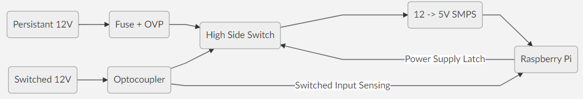

# CarPiHAT - The Raspberry Pi Automotive Interface HAT

The CarPiHat has been designed to make interfacing your Raspberry Pi to your car, boat, truck, or any 12V based system much easier. Originally designed to help with my OpenAuto pro installation, demand grew for the board and I have decided to run a few batches of them. For anyone interested in purchasing a HAT, please do so via the Tindie link below:
[https://www.tindie.com/products/tjd/carpihat-raspberry-pi-car-interface-pcb/](https://www.tindie.com/products/tjd/carpihat-raspberry-pi-car-interface-pcb/)

Currently, the HAT is not open source, although at some point in the future I may explore this option further. 
# Features:
-   12V - 5V buck converter to power the pi optional touchscreen, with fuse and filtering.
-   Safe shutdown circuitry to allow the pi to control its own power, and to remove any parasitic drain when off.
-   Dedicated reverse, illumination and aux inputs, all opto isolated.
-   2 opto isolated general purpose inputs. (for a total of 5 inputs)
-   2 high current, high side switched 12V outputs (@1A). (for switching relays, LED's ect)
-   1 independent CAN bus interface.
-   Real time clock to maintain system time across reboots.
-   Broken out I2C bus.
-   Broken out 1W for temperature sensor ect.
-   Long pins to allow HAT stacking.
# Pinout:


# Power Supply:
 The power supply features the following basic topology:
 


This means that the Raspberry Pi is switched on with the "Switched 12V". It then latches its own power, and looks for the "Switched 12V" to be turned off. It then performs a graceful shutdown, delatching the power supply when the CPU shuts down. You can, of course, leave the Pi powered up for as long as you like, if you are relying on the raspberry pi to be powered up for other tasks.

**GPIO Layout:**
- PSU Latch: **BCM25**
- 12V Sense: **BCM12**
# Opto-Isolated Inputs:
The board features a few general purpose inputs, that can be used for things such as an ilumination sense, reverse detect or handbrake input. These are pretty standard opto-isolated inputs, and can accept between 12-18V. a HIGH input will bring the corresponding Pi GPIO pin HIGH. There is no difference between the "Reverse" or "Ilumination" input, and the "IN_1" and "IN_2" inputs, other than their names, so they can all be used interchangebly. 

**GPIO Layout:**
- Reverse: **BCM19** ??? CHANGE THIS???
- Ilumination: **BCM13**
- IN_1: **BCM14**
- IN_2: **BCM17**

# 12V Outputs:
The board offers 2x high side switched 12V outputs, rated at 1A per channel. These are perfect for driving small loads such as relays, fans or LED interior lighting. A HIGH GPIO will result in a HIGH output. 

**GPIO Layout:**
- OUT_1: **BCM22**
- OUT_2: **BCM27**

# CAN Bus Interface:
The CarPiHat provides a transparent CAN bus interface, presented in Linux simply as a network interface. A MCP2515 offers the SPI to CAN conversion, whilst an MCP2558 handles the bus transmission. 
A 120 Ohm termination resistor is present between CANH and CANL.

Typically, setup should be completed throught the onboard configuration EEPROM, however in the case that the interface is not showing up, or you would like to manually tweak the settings, then follow the below instructions:

Add the following to the bottom of your "/boot/config.txt"
>dtparam=spi=on
>dtoverlay=mcp2515-can0,oscillator=8000000,interrupt=23
>dtoverlay=spi-bcm2835-overlay

And then add the following to "/etc/rc.local"

>/sbin/ip link set can0 up type can bitrate 100000

The MCP2515 is connected using the SPI interface, and uses an 8MHz cruystal.
**GPIO Layout:**
- MOSI: **BCM10**
- MISO: **BCM9**
- SCLK: **BCM11**
- CS: **BCM8**
- INT: **BCM23**

# Real Time Clock:
The board features a real time clock that can be used to keep track of the system time across reboots. a DS3231MZ is used for this, connected using the I2C bus. Since there is no battery backup on the board, the RTC is kept powered using the persistant 12V supply. The clock is supported within Raspbian, and thus no custom scripts are required. The OS simply reads the time on boot. 

Typically, setup should be completed throught the onboard configuration EEPROM, however in the case that the interface is not showing up, or you would like to manually tweak the settings, then follow the below instructions:

Enable I2C Through 
>raspi config

Add the following to "/etc/rc.local"
>echo ds1307 0x68 > /sys/class/i2c-adapter/i2c-1/new_device
>hwclock -s

Then, add the following to "/etc/modules"
>rtc-ds1307

**GPIO Layout:**
- SDA: **BCM2**
- SCL: **BCM3**

# Safe Shutdown Example:
There are various ways to implement the safe shutdown, depending on what your application requires. Here is one example, suited to using as a head unit inside a typical car. This will latch power as soon as the Pi boots, then monitor the switched 12V line for power loss. When this occurs, it will perform a safe shutdown of the Raspberry Pi, and then delatch the power. 

First of all, we need a small python script to monitor the power state:
```
import RPi.GPIO as GPIO # import our GPIO module
import time
from subprocess import call

GPIO.setmode(GPIO.BCM) # we are using BCM pin numbering

IGN_PIN = 12		# our 12V switched pin is BCM12
EN_POWER_PIN = 25	# our latch pin is BCM25

IGN_LOW_TIME = 10 # time (s) before a shutdown is initiated after power loss

GPIO.setup(IGN_PIN, GPIO.IN) # set our 12V switched pin as an input

GPIO.setup(EN_POWER_PIN, GPIO.OUT) # set our latch as an output

GPIO.output(EN_POWER_PIN, 1) # latch our power. We are now in charge of switching power off

ignLowCounter = 0

while 1:
	if GPIO.input(IGN_PIN) != 1: 				# if our 12V switched is not disabled
		time.sleep(1)							# wait a second
		ignLowCounter += 1						# increment our counter
		if ignLowCounter > IGN_LOW_TIME:		# if it has been switched off for >10s
			print("Shutting Down")
			call("sudo shutdown -h now", shell=True)	# tell the Pi to shut down
	else:
		ignLowCounter = 0 						# reset our counter, 12V switched is HIGH again
```
Save this script to "/home/pi/carPiHat.py"

Then add the following to "/etc/rc.local"
>sudo python carPiHat.py

This will start the script when the Pi boots.

Next, add the following to "/boot/config.txt"
>dtoverlay=gpio-poweroff,gpiopin=25,active_low

This will ensure our latch pin is held low after the Pi switches off, disabling the latch and cutting off any parasitic power draw.
